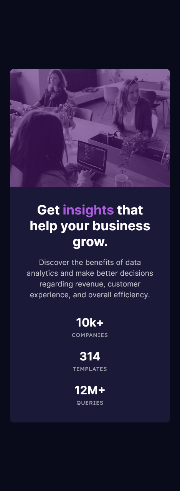

# Frontend Mentor - Stats preview card component solution

This is a solution to the [Stats preview card component challenge on Frontend Mentor](https://www.frontendmentor.io/challenges/stats-preview-card-component-8JqbgoU62). Frontend Mentor challenges help you improve your coding skills by building realistic projects. 

## Table of contents

- [Overview](#overview)
  - [The challenge](#the-challenge)
  - [Screenshot](#screenshot)
  - [Links](#links)
- [My process](#my-process)
  - [Built with](#built-with)
  - [What I learned](#what-i-learned)
  - [Continued development](#continued-development)
  - [Useful resources](#useful-resources)
- [Author](#author)

## Overview

### The challenge

Users should be able to:

- View the optimal layout depending on their device's screen size

### Screenshot




### Links

- Solution URL: [Github](https://github.com/MikeBeloborodov/02_stats_preview_card_frontendmentor)
- Live Site URL: [Netlify](https://gorgeous-gnome-55c2f9.netlify.app/)

## My process

### Built with

- Semantic HTML5 markup
- CSS custom properties
- Flexbox
- CSS Grid
- Mobile-first workflow

### What I learned

I mostly improved my flexbox understanding, for example how to make 2 flex containers have their full size:

```css
.card {
    display: flex;
}

.card__text-area {
    flex: 1 1 0;
}
```

Also, for the first time I made my own media queries, which wasn't as hard as I expected:

```css
@media(min-width: 1440px) {
    .card {
      ...
    }
}
```

Another challenging thing was to make the provided black and white picture have this purpleish tint, so I decided to put this picture in a div and give it a purple background color. After that I lovered the opacity of my picture to see the color behind it.

```css
.image-tint {
    background-color: hsl(277, 64%, 28%);
}

img {
    opacity: 0.4;
}
```

The last interesting thing was changing between desktop and mobile pictures, I decided to use a method, that I've learned from Kevin Powell (https://www.youtube.com/@KevinPowell). It uses <picture> tag and a <source> tag to change between pictures when a certain media query fires: 

```html
<picture class="card__image">
  <source srcset="images/image-header-desktop.jpg" media="(min-width: 1440px)">
  
</picture>
```

### Continued development

I think that I still don't really understand flexbox fully, and also would like to work on my grid layout aswell.

Also maybe work on my animations a little bit next time.

### Useful resources

- [Example resource 1](https://stackoverflow.com/) - Of cource answered some of my simple questions, but mostly it was youtube or MDN.

## Author

- Github - [Mike Beloborodov](https://github.com/MikeBeloborodov)
- Frontend Mentor - [@MikeBeloborodov](https://www.frontendmentor.io/profile/MikeBeloborodov)
